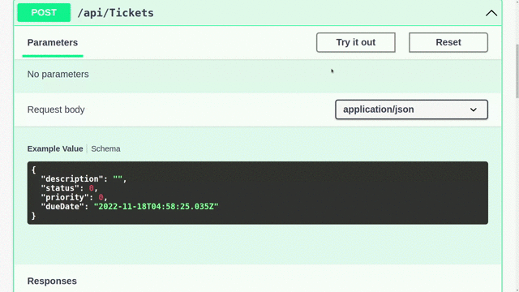
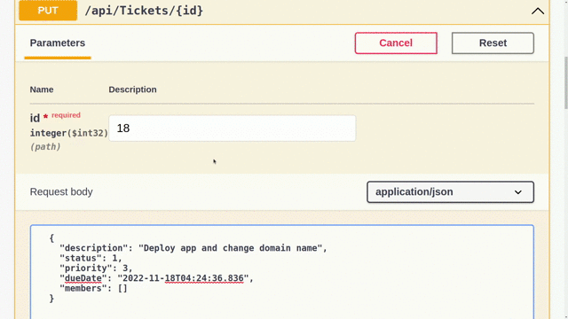

# Issue Tracker Backend

🚧 Under Construction

The backend of an issue tracker app I'm working on right now. 
- Built using **ASP .Net Core Web API**
- DB: **MS SQL Server**
- **REST APIs** with full **CRUD** operations
- Supports **User Authentication** and **Authorization**

## Preview

### Create a new issue ticket

### Assign a ticket to developer(s)

### Get all tickets

